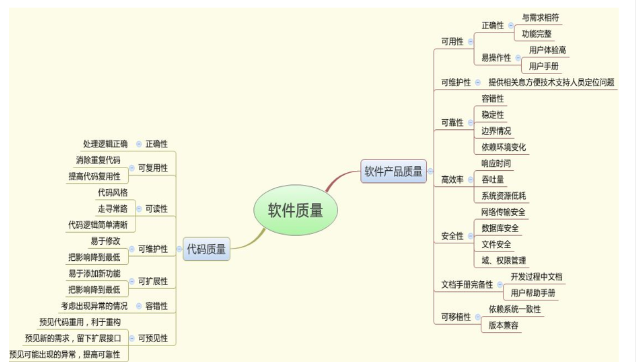
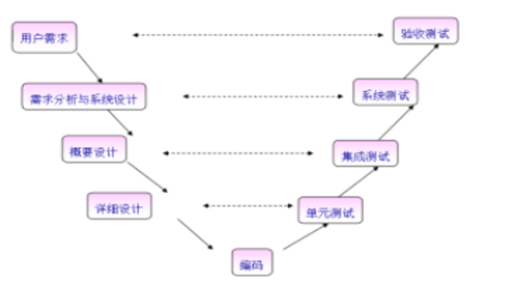
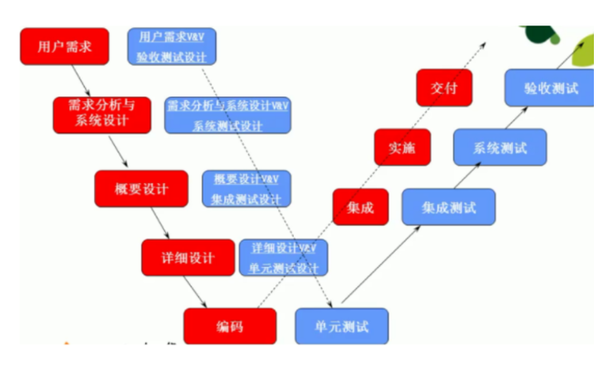
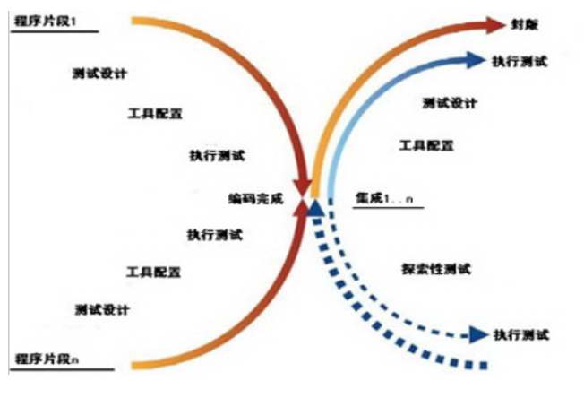
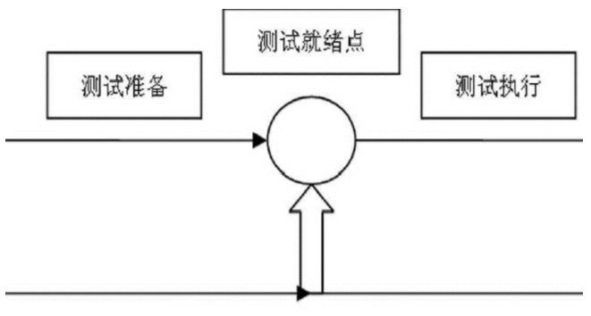

#### 1、什么是软件测试？

##### 广义概念

```
指软件生存周期中所有的检查、评审和确认工作，其中包括了对分析、设计阶段、以及完成开发后维护阶段的各类文档、代码的审查和确认。
```


##### 狭义概念

- 识别软件缺陷的过程，即实际结果与预期结果的不一致

- 软件测试通常包括**验证（verification）**和**确认（validation）**


#### 2、软件测试的目的

- 测试的目的就是发现软件中的各种缺陷
- 测试只能证明软件存在缺陷，不能证明软件不存在缺陷
- 测试可以使软件中缺陷降低到一定程度，而不是彻底消灭
- 以较少的用例、时间和人力找出软件中的各种错误和缺陷，以确保软件的质量


#### 3、软件测试原则

- Good-enough：一种权衡投入/产出比的原则
- 保证测试的覆盖程度，但穷举测试是不可能的
- 所有的测试都应追溯到用户需求
- 越早测试越好，测试过程与开发过程应是相结合的
- 测试的规模由小到大，从单元测试到系统测试
- 充分注意测试中的群集现象。经验表明，测试后程序中残存的错误数目与改程序中已发现的错误数目成正比，不能为了便于测试擅自修改程序
- 即应该测试软件该做什么也应该测试软件不该做什么

##### Good-enough

```
对于相对复杂的产品或系统来说，zero-bug是一种理想，good-enough是我们的原则。

Good-enough原则就是一种权衡投入/产出比的原则：
不充分的测试是不负责任的；过分的测试是一种资源的浪费，同样也是一种不负责任的表现。
我们的操作困难在于：
如何界定什么样的测试是不充分的，什么样的测试是过分的。
目前状况唯一可用的答案是：
制定最低测试通过标准和测试内容，然后具体问题具体分析。
```

 **木桶原理** 

```
在软件产品生产方面就是全面质量管理(TQM)的概念。产品质量的关键因素是分析、设计和实现，测试应该是融于其中的补充检查手段，其他管理、支持、甚至文化因素也会影响最终产品的质量。应该说，测试是提高产品质量的必要条件，也是提高产品质量最直接、最快捷的手段，但决不是一种根本手段。反过来说，如果将提高产品质量的砝码全部押在测试上，那将是一个恐怖而漫长的灾难。
```

 **Bug的80-20原则**

```
实践证明。80%的bug往往隐含在20%的软件区域。所以一旦在某处发现了bug，多找找周围。这也是有经验的测试员的一种方式。
一般情况下，在分析、设计、实现阶段的复审和测试工作能够发现和避免80%的Bug，而系统测试又能找出其余Bug中的80%，最后的5%的Bug可能只有在用户的大范围、长时间使用后才会曝露出来。因为测试只能够保证尽可能多地发现错误，无法保证能够发现所有的错误。
```

#### 4. 软件测试质量与产品质量

- ##### 功能性

  ```
  软件所实现的功能满足用户需求的程度．功能性反映了所开发的软件满足用户称述的或蕴涵的需求的程度，即用户要求的功能是否全部实现了。
  ```

- ##### 可靠性

  ```
  在规定的时间和条件下，软件所能维持其性能水平的程度。可靠性对某些软件是重要的质量要求，它除了反映软件满足用户需求正常运行的程度，且反映了在故障发生时能继续运行的程度。
  ```

- ##### 易使用性

  ```
  对于一个软件，用户学习、操作、准备输入和理解输出时，所做努力的程度。易使用性反映了与用户的友善性，即用户在使用本软件时是否方便。
  ```

- ##### 效率

  ```
  在指定的条件下，用软件实现某种功能所需的计算机资源（包括时间）的有效程度。效率反映了在完成功能要求时，有没有浪费资源，此外"资源";这个术语有比较广泛的含义，它包括了内存、外存的使用，通道能力及处理时间。
  ```

- ##### 可维护性

  ```
  在一个可运行软件中，为了满足用户需求、环境改变或软件错误发生时，进行相应修改所做的努力程度。可维修性反映了在用户需求改变或软件环境发生变更时，对软件系统进行相应修改的容易程度。一个易于维护的软件系统也是一个易理解、易测试和易修改的软件，以便纠正或增加新的功能，或允许在不同软件环境上进行操作。
  ```

- ##### 可移值性 

  ```
  从一个计算机系统或环境转移到另一个计算机系统或环境的容易程度。
  ```


#### 产品质量与代码质量：




### 5. 软件测试度量

- ##### 测试覆盖率

- ##### 缺陷发现率

- ##### 测试成功率


### 6.软件可测试性

 **软件容易被测试的程度，包括下面几个指标：** 

- 可确认性：可以明确确认软件是否符合要求，例如有明确的要求和指标。
- 可观察性：用于确认的结果可以进行有效的观察。
- 可控制性：相对应的测试环境可以进行控制，从而保证测试的有效性。
- 可分解性：软件可以进行分解，对分解的结构进行测试。


### 7.软件测试过程

- 拟定软件测试计划。

- 设计软件测试策略。

- 设计和生成测试用例、准备测试数据。

- 执行测试，记录原始数据，对缺陷进行管理。

- 生成软件测试报告、缺陷的统计和报表。

- 回归测试。

  

##### 软件开发流程（软件生命周期）：

计划-》需求分析-》设计-》程序编写-》测试-》运行/维护

##### 对应的软件测试流程：

测试计划-》需求分析-》测试用例-》测试用例执行-》提交bug-》回归测试

##### 软件测试计划

- 时间进度和人员安排、风险管理。
- 测试范围的确定、测试数据的生成。
- 测试工具、方法的选择和工具开发。
- 测试完成标准。
- 影响资源分配的特殊考虑等。

###### 软件测试策略

- 定义被测软件功能以及相关的测试，并详细说明的测试方法和策略。
- 创建测试方案是开始测试设计的第一步。测试方案的定义应当基于需求分析和设计文档，并遵从测试计划文档。

##### 软件测试用例

- 为实施一次测试而向被测系统提供的输入数据、操作或各种环境设置。
- 控制着软件测试的执行步骤。
- 是对测试方案中每个测试项的进一步实例化。

##### 软件测试的执行

- 执行测试用例。
- 记录原始测试数据。
- 记录缺陷。
- 对所发现的缺陷进行跟踪、管理和监控。

##### 软件测试报告

总结测试的结果，通过与未通过的测试用例，并对被测软件对象进行评估

##### 测试总结：

- 评价软件质量。
- 分析提交客户后的缺陷预测分析，以及维护成本分析。
- 对测试工作进行经验、教训、建议总结。


### 8.软件测试模型

- V模型
- W模型
- H模型
- X模型

##### 软件开发模型：

- **瀑布模型**：适用于需求很明确的项目，分阶段向下进行，无法回溯。
- **迭代模型**：需求不明确，迭代版本系统。
- **敏捷开发模型**：　　敏捷开发是一种以人为核心、迭代、循序渐进的开发方法。 在敏捷开发中，软件项目被切分成多个子项目，各个子项目的成果都经过测试，具备集成和可运行的特征。换言之，就是把一个大项目分为多个相互联系，但也可独立运行的小项目，并分别完成，在此过程中软件一直处于可使用状态。
- **测试驱动开发模型**：先编写测试代码，再写开发代码。

##### 软件测试模型-V模型



在软件测试方面，V模型是最广为人知的模型，尽管很多富有实际经验的测试人员还是不太熟悉V模型，或者其它的模型。V模型已存在了很长时间，和瀑布开发模型有着一些共同的特性，由此也和瀑布模型一样地受到了批评和质疑。V模型中的过程从左到右，描述了基本的开发 过程和测试行为。

V模型的价值在于它非常明确地标明了测试过程中存在的不同级别，并且清楚地描述了这些测试阶段和开发过程期间各阶段的对应关系。

**局限性：** 把测试作为编码之后的最后一个活动，需求分析等前期产生的错误直到后期的验收测试才能发现.

##### 软件测试模型-W模型



V模型的局限性在于没有明确地说明早期的测试,无法体现“尽早地和不断地进行软件测试” 的原则。在V模型中增加软件各开发阶段应同步进行的测试，演化为W模型（如下图）。在模型中不难看出，开发是“V”，测试是与此并行的“V”。基于“尽早地和不断地进行软件测试”的原则

W模型相对于V模型，W模型更科学。W模型是V模型的发展，强调的是测试伴随着整个软件开发周期，而且测试的对象不仅仅是程序，需求、功能和设计同样要测试。测试与开发是同步进行的，从而有利于尽早地发现问题。

##### 软件测试模型-X模型



X模型也是对V模型的改进,X模型提出针对单独的程序片段进行相互分离的编码和测试,此后通过频繁的交接,通过集成最终合成为可执行的程序

X模型的左边描述的是针对单独程序片段所进行的相互分离的编码和测试，此后将进行频繁的交接，通过集成最终成为可执行的程序，然后再对这些可执行程序进行测试。己通过集成测试的成品可以进行封装并提交给用户，也可以作为更大规模和范围内集成的一部分。多根并行的曲线表示变更可以在各个部分发生。由图中可见，X模型还定位了探索性测试，这是不进行事先计划的特殊类型的测试，这一方式往往能帮助有经验的测试人员在测试计划之外发现更多的软件错误。但这样可能对测试造成人力、物力和财力的浪费，对测试员的熟练程度要求比较高。

+


##### 软件测试模型-H模型



H模型中,软件测试过程活动完全独立,贯穿于整个产品的周期,与其他流程并发地进行,某个测试点准备就绪时,就可以从测试准备阶段进行到测试执行阶段。软件测试可以尽早的进行,并且可以根据被测物的不同而分层次进行。

这个示意图演示了在整个生产周期中某个层次上的一次测试“微循环”。图中标注的其它流程可以是任意的开发流程,例如设计流程或者编码流程。也就是说,只要测试条件成熟了,测试准备活动完成了,测试执行活动就可以进行了。

H模型揭示了一个原理:软件测试是一个独立的流程,贯穿产品整个生命周期,与其他流程并发地进行。H模型指出软件测试要尽早准备,尽早执行。不同的测试活动可以是按照某个次序先后进行的,但也可能是反复的,只要某个测试达到准备就绪点,测试执行活动就可以开展

##### 各种模型的比较

**1.软件测试过程模型**－V模型是软件开发瀑布模型的变种，主要反映测试活动与分析和设计的关系；

**局限性**：把测试作为编码之后的最后一个活动，需求分析等前期产生的错误直到后期的验收测试才能发现。

**2.软件测试过程模型－W模型**

在V模型的基础上，增加千开发阶段的同步测试，形成W模型；测试与开发同步进行，有利用尽早的发现问题

**局限性**：仍把开发活动看成是从需求开始到编码结束的串行活动，只有上一阶段完成后，才可以开始下一阶段的活动，不能支持迭代，自发性以及变更调整。

**3.软件测试过程模型－H模型**

在H模型中，软件测试过程活动完全独立，贯穿于整个产品的周期，与其他流程并发地进行，某个测试点准备就绪时，就可以从测试准备阶段进行到测试执行阶段；软件测试可以进行尽早的进行；软件测试可以根据被测物的不同而分层次进行。

测试模型使用软件

在实际工作中应灵活地运用各种模型的优点

4.**V模型**:强调了在整个软件项目开发中需要经历的若干个测试级别，并与每一个开发级别对应；忽略了测试的对象不应该仅仅包括程序，没有明确指出对需求、设计的测试。

**W模型**:补充了V模型中忽略的内容，强调了测试计划等工作的先行和对系统需求和系统设计的测试；与V模型相同，没有对软件测试的流程进行说明。

**H模型**:强调测试是独立的，只要测试准备完成，就可以执行测试。


### 8.探索性软件测试

- 选取业务和技术领域上的测试专家，按照制定好的测试主题对应用进行自由测试，从普通用户的视角上，结合自身的专业知识找出应用中的缺陷。包括自由式、反馈式、策略与场景式测试。
- 目前大多数的探索测试是作为传统测试的补充，补充分支与异常的测试用例。理想状态下，随着探索性测试的成熟，通过探索性测试替代分支与异常测试，漫游测试代替基本的测试用例。

#### 与其它测试不同

##### Monkey测试

- 动手不动脑、无需IT和业务知识；完全随机、不用培训。

##### 传统测试

- 动手也动脑、需要IT和业务知识。
- 依据功能点测试正常、异常分支，容易有场景遗漏。
- 基于经验，很难积累和技能传递，部分随机、很难培训。

##### 探索性软件测试

- 有计划和有目的的开展，需要IT和业务知识。
- 有抽象的方法论便于积累和技能传递，很容易培训。
- 单位时间内，发现的bug数和取得的代码覆盖率高。
- 尽早发现更多软件质量风险的测试手段。
- 来源用户行为模式和软件出错模式的抽象。
- 基于用户场景，通过模拟用户操作，接近真实的复杂用户行为启发测试人员的思维。
- 是对传统测试设计方法的一个颠覆。
- 是一般性测试的重要补充。

#### 测试阶段-漫游类

- 基于功能，全面验证需求。作用：预测试和功能基本路径验证。衡量指标：代码覆盖率。


#### 测试阶段-探索类

- 基于用户场景 发现更深层次的bug，MRD不一定有提及 ，衡量指标是用户场景覆盖情况。

##### 测试方法包括：

- 极限测试法：在上下边界附近进行测试，只为寻找一个突破点。
- 场景插入法：场景插入法描述的是一个从一个场景跳到另一个场景的方式。从而把两个或者更多场景结合为一个具有混合目的的场景。比如在使用使用应用过程中，突然来电。
- 测一送一法：重复某个操作or操作的组合反复连续执行10次以上。
- 反叛法：要求输入最不可能的数据，或者已知的恶意输入。
- 出租车法：测试所有能到达同一目的的操作序列。
- 快递测试法：输入一个数据后，观察所有显示地方是否都正确显示。
- 懒汉测试法：以软件的默认值为测试数据执行测试。

### 9. 竞品测试

选取与被测应用功能、非功能设计指标相近的同类应用，对各个指标进行定量对比。

#### 流程：

- 竞品分析（竞品范围制定及选择具体竞品）
- 制订竞品测试策略
- 设定指标，如功能、兼容性、可靠性、用户体验、安全性等（每项具体子项可根据业务来进行指定）
- 设定测试场景（相同环境&执行类似路径）
- 设定执行策略（次数&时间）
- 设定结果策略（均值&对比）
- 执行测试并记录结果

### 10. 本地化测试

#### 测试范围

- 受本地化影响的方面，如UI和内容
- 区域性或区域设置特定的、语言特定的和地区特定的方面

#### 测试内容

- 基本功能测试
- 在本地化环境中运行的安装和升级测试
- 根据产品的目标地区计划应用程序兼容性测试
- 文化、宗教、喜好等适用性测试